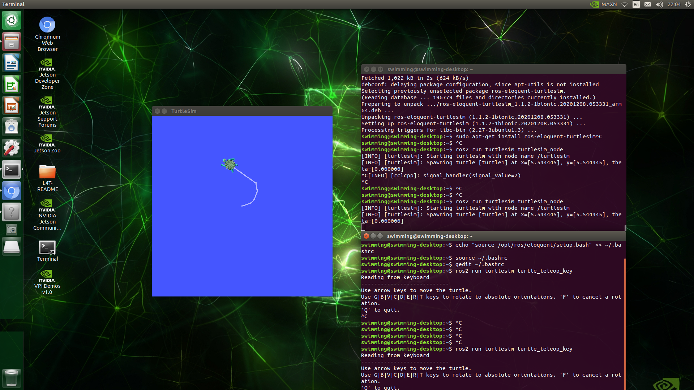

# 젯슨 나노에 ROS2를 설치하고 구동해보기

## Tested Environment
* Jetson Nano 4GB
* Latest iso image from nvidia (Ubuntu 18.04 with Jetpack 4.5)

## Usage

(1) Download & Install

```
git clone https://github.com/kimsooyoung/installROS2.git
cd installROS2
chmod +x install-ros2.sh

./install-ros.sh
(or)
sh install-ros.sh
```

(2) Start turtlesim 

ros의 마스코트인 turtlesim을 실행시켜보는 것으로 설치 확인을 해보겠습니다.
터미널을 열고 다음 커멘드를 입력해줍니다.

```
ros2 run turtlesim turtlesim_node
```
다음 그림과 같이 거북이의 일러스트가 나타나면 성공입니다.
새로운 터미널을 열어 다음과 같이 거북이를 움직일수 있는 `turtle_teleop_key` 노드를 실행시킵니다.

```
ros2 run turtlesim turtle_teleop_key
```



## Reference
---

[1] https://index.ros.org/doc/ros2/Installation/Eloquent/

[2] https://colcon.readthedocs.io/en/released/user/installation.html

[3] https://github.com/jugfk/installROS

